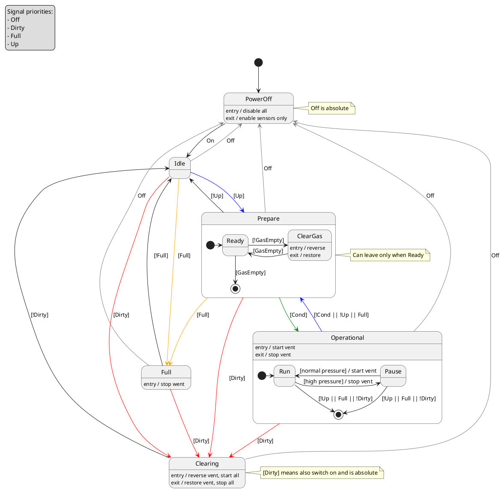

# CO2 condesator
## Scope
This is a device and program description for CO2 condencer device in Stationeers game.
The document describe the device, and the LUA script controlling it work
## Principle
The CO2 condemnced device is ientended for fast collecting of large volumes of liquid cold CO2 gas.
It works on Mars setup.
Under working tempereature [-25°C..-50°C] it pressurise atmoshere with help of large vent into insolated gas tank. For certain pressure and temprature (see CO2 description in the game help) the CO2 take phase shift to liquid sustain. This liquid is absorbed by passive licker vent into liquid tank.
The pressure limits defined form the perspective that less than -55°C CO2 has solid state that corrup tubes.
The temepreature high than -25°C the condesation point of CO2 is bigger than condesation point of Polutant and liquid is contaminated with liquid polutatnt.
See CO2 and Pol tables in the code.
## Device description
Device consist:
- Modular Console containing switches, indicators and siaplays
  - Power On/Of switch
  - Up switch - run or stop
  - Clear switch - force to clear full system
- Lua controller chip
- Device
  - External temperature sensor
  - Insolated gas tank
  - High pressure vent connecting to gas tank
  - Gas sensor connected to gas tank
  - Passive licker to remove liquid from gas tank to the liquid tank
  - Liquid tank
  - Liquid sensor connected to liquid tank
  - Absorption pomp connected to liquid tank for clearing
  - Absorption gas pupm conncted to liquid tank for clearing
  - Active output drain after absoption pump for clearing
## Device state mchine

