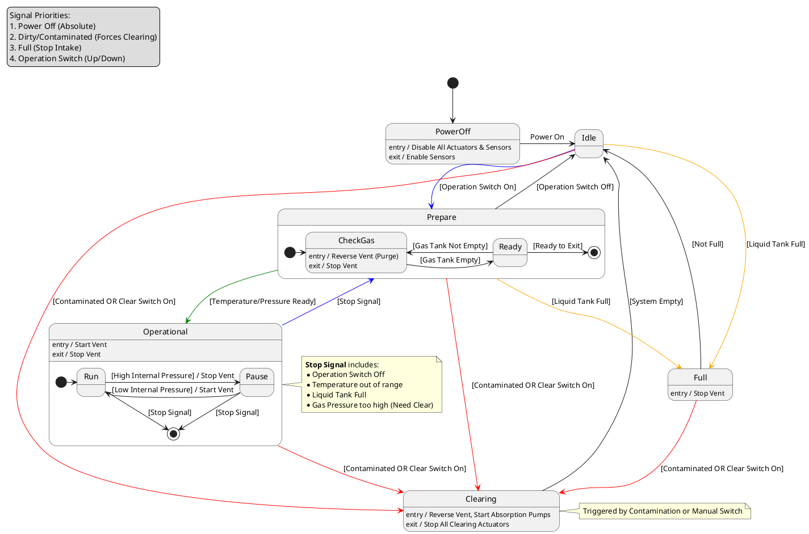

# CO2 Condenser
## Scope
This document describes the device and control logic for the CO2 Condenser system in Stationeers. It covers the physical setup, the operating principles, and the logic implemented in the Lua script.

## Principle
The CO2 Condenser is designed for the rapid collection of large volumes of liquid CO2. It is optimized for the Martian environment.

Under ideal working temperatures (-25°C to -50°C), the system uses a high-pressure vent to pressurize the atmosphere into an insulated gas tank. When the specific pressure and temperature thresholds are met (refer to the CO2 phase diagram in the Stationeers help), the CO2 undergoes a phase shift into a liquid state. This liquid is then removed from the gas tank and transferred to a liquid storage tank via a passive liquid inlet (often called a "licker").

### Safety and Purity Limits
- **Pressure Limits:** If temperatures drop below -55°C, CO2 can transition into a solid state (dry ice), which will damage or destroy piping and tanks.
- **Temperature Limits:** Above -25°C, the condensation point of CO2 becomes higher than that of pollutants. This leads to the liquid CO2 being contaminated with liquid pollutants.
- Refer to the CO2 and Pollutant (Pol) tables in the control script for precise phase-change data.

## Device Description
The system consists of the following components:

### Control Console
A modular console containing:
- **Power Switch:** Master power for the entire system.
- **Operation Switch (Up):** Starts or stops the condensation process.
- **Clear Switch:** Manually forces a system purge to empty all tanks.
- **Indicators:** LED lights showing system status (Idle, Prepare, Operational, Full, Clearing, and Dirty/Contaminated).
- **Displays:** Six LED displays showing external temperature, gas tank temperature/pressure, and liquid tank temperature/pressure/volume.

### Hardware
- **Lua Controller:** Runs the `luquid-co2.lua` script.
- **Sensors:**
  - External Gas Sensor (External temperature monitoring).
  - Pipe/Tank Gas Sensor (Internal gas tank monitoring).
  - Pipe/Tank Liquid Sensor (Internal liquid tank monitoring).
- **Actuators:**
  - High-Pressure Vent (Main intake).
  - Liquid Absorption Pump & Drain (Liquid tank clearing).
  - Gas Absorption Pump (Gas removal from liquid tank).
  - Passive Liquid Inlet (Licker vent between gas and liquid tanks).

## Device State Machine

